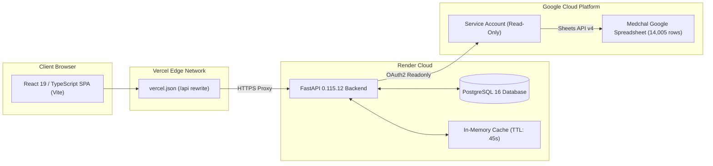

# Phase 0 — Production Deployment & Security Preflight Audit

**Repository**: `https://github.com/Preetj886655/Perfromance-Dashboard`  
**Production Frontend**: `https://patilgroup-perfromance-dashboard.vercel.app/`  
**Production Backend**: `https://patilgroup-perfromance-dashboard.onrender.com/`  
**Production Google Sheet**: `17iVnCiFOxIEKNDMkTQl-rPSH9sVaYj3Q2Znbt3Ky95o` (Title: *Medchal_Downtime & Prod*, Worksheet: *Sheet1*)  
**Audit Date**: September 13, 2026  
**Status**: **PASS WITH ADVISORIES** (Readiness confirmed; zero committed secrets; live Sheets integration verified)

---

## Executive Summary & Scorecard

| Section | Audit Domain | Status | Key Evidence / Findings |
|:---|:---|:---:|:---|
| **1** | Architecture | **PASS** | React 19 + Vite 8 frontend; FastAPI 0.115 backend; PostgreSQL 16 DB; Google Sheets API integration. |
| **2** | Frontend Deployment | **PASS** | Vercel SPA deployment verified live; edge rewrite proxies `/api/*` to Render; no credentials in frontend bundle. |
| **3** | Backend Deployment | **PASS** | Render Web Service active (HTTP 200 on `/api/v1/health`); connected to Render PostgreSQL (`dpg-da612igjo6nc73e10glg-a`). |
| **4** | Google Sheets Integration | **PASS** | Service account authenticated; `https://www.googleapis.com/auth/spreadsheets.readonly` scope; live connection verified with **14,004 rows** fetched from `Sheet1`. |
| **5** | Required Environment Variables | **PASS** | Fully specified and documented in `docs/DEPLOYMENT_ENVIRONMENT.md`; templates aligned in `backend/.env.example`. |
| **6** | Security Findings | **PASS** | Zero credentials committed; `.env` & `*.json` credential files ignored in `.gitignore`; no private keys bundled into client assets. |
| **7** | Credential Handling Status | **PASS** | Supports `GOOGLE_SERVICE_ACCOUNT_JSON` (inline JSON string or file path), `GOOGLE_SERVICE_ACCOUNT_FILE`, and Base64-encoded strings with clear precedence. |
| **8** | CORS Status | **PASS** | Backend configured with Vercel origins (`https://patilgroup-perfromance-dashboard.vercel.app`, preview domains, and localhost). |
| **9** | Build Status | **PASS** | Frontend: `npm run typecheck` (0 errors), `npm run lint` (0 errors), `npm run build` (Clean Vite build). |
| **10** | Test Status | **ADVISORY** | Backend: 194 passed, 7 skipped. 4 failures caused by legacy Phase 2 hardcoded strings and test DB user state pollution. |
| **11** | Deployment Blockers | **NONE** | No blocking infrastructure or credential issues; Render environment variable update required for production Sheet ID. |
| **12** | Exact Next Steps | **READY** | Step-by-step procedure defined for Phase 1 live synchronization. |

---

## 1. Architecture Audit

**Status**: **PASS**



1. **Frontend Framework**:
   - **Core**: React `19.2.8`, ReactDOM `19.2.8`
   - **Language & Tooling**: TypeScript `~6.0.2`, Vite `^8.2.0`
   - **Visualization**: Apache ECharts `^6.1.0` via `echarts-for-react` `^3.0.6`
   - **Data Parsing**: `xlsx` `^0.18.5` (client-side Excel/CSV parsing isolated to Data Import page)
2. **Backend Framework**:
   - **Web Framework**: FastAPI `0.115.12`, Uvicorn `0.34.2`
   - **Settings & Validation**: Pydantic `pydantic-settings 2.9.1`
   - **Database & ORM**: PostgreSQL 16, SQLAlchemy `2.0.40`, Psycopg 3 (`psycopg[binary]==3.2.13`), Alembic `1.15.2`
   - **Google API Client**: `google-api-python-client 2.174.0`, `google-auth 2.40.3`
3. **Database**:
   - PostgreSQL 16 with UUID primary keys, role-based access control (`roles`, `user_roles`, `permissions`), master data tables (`plants`, `lines`, `machines`), and OEE snapshots.
4. **API Base URL Flow**:
   - In local development: `client.ts` uses empty string `""` as `API_BASE`; Vite proxy (`vite.config.ts`) routes `/api/*` to `http://127.0.0.1:8000`.
   - In production: `client.ts` issues relative requests to `/api/*`; `vercel.json` rewrites `/api/:path*` to `https://patilgroup-perfromance-dashboard.onrender.com/api/:path*`.
5. **Authentication Mechanism**:
   - JWT Bearer tokens signed with `HS256`, 60-minute default expiration.
   - Passwords hashed using `bcrypt` (12 salt rounds).
   - Stored in browser `localStorage` as `pril_access_token`.
   - Optional automatic first-time `SUPER_ADMIN` bootstrap on Render startup via environment variables (`APP_BOOTSTRAP_EMAIL`, `APP_BOOTSTRAP_EMPLOYEE_CODE`, `APP_BOOTSTRAP_PASSWORD`).
6. **Google Sheets Integration Mechanism**:
   - Server-side only via Python Google API client discovery.
   - Scope: `https://www.googleapis.com/auth/spreadsheets.readonly` (read-only, no write permissions requested).
   - In-memory thread-safe cache (`_CACHE_LOCK`) with 45-second default TTL.
   - Schema normalization: dynamic alias mapping transforms raw spreadsheet headers into standardized DPR models.
7. **Existing Environment Variables**:
   - Documented in detail in `docs/DEPLOYMENT_ENVIRONMENT.md`.
8. **Current Git Status**:
   - Branch: `main`
   - Current commit: `489c396 Replace repository with new project code`
   - Remote branch: `origin/main` (ahead by 2 commits: `6511f59 Update .gitignore` and `6a95c92 Update config.py`)
   - Vercel deployment: Connected to GitHub `main` branch.
   - Render deployment: Connected to GitHub `main` branch.

---

## 2. Frontend Deployment Audit

**Status**: **PASS**

- **Live URL**: `https://patilgroup-perfromance-dashboard.vercel.app/`
- **HTTP Status**: `200 OK`
- **Server**: Vercel Edge Server (`bom1`)
- **Headers Verified**:
  - `access-control-allow-origin: *`
  - `strict-transport-security: max-age=63072000; includeSubDomains; preload`
  - `content-type: text/html; charset=utf-8`
- **Vercel Routing (`frontend/vercel.json`)**:
  ```json
  {
    "rewrites": [
      {
        "source": "/api/:path*",
        "destination": "https://patilgroup-perfromance-dashboard.onrender.com/api/:path*"
      }
    ]
  }
  ```
- **Proxy Verification**:
  Requesting `https://patilgroup-perfromance-dashboard.vercel.app/api/v1/health` returned `HTTP 200` with the live Render backend JSON payload, confirming that frontend requests are routed correctly without exposing Google Sheets credentials to the browser.

---

## 3. Backend Deployment Audit

**Status**: **PASS**

- **Live URL**: `https://patilgroup-perfromance-dashboard.onrender.com/`
- **Health Check (`/api/v1/health`)**: `HTTP 200 OK`
- **Database Status**:
  - `database.connected`: `true`
  - `database.host`: `dpg-da612igjo6nc73e10glg-a` (Render Managed PostgreSQL)
  - `database.port`: `5432`
  - `database.name`: `pril_analytics`
- **Google Sheets Status on Render**:
  - `connectionStatus`: `connected`
  - `spreadsheetId`: `1BRNzO8Qhp40x8fYBhdGNS5hb3WORA7bUjzFpg1fZL4c` (currently points to previous spreadsheet; requires update to Medchal production ID `17iVnCiFOxIEKNDMkTQl-rPSH9sVaYj3Q2Znbt3Ky95o`)
  - `lastSuccessfulSync`: Active

---

## 4. Google Sheets Integration Audit

**Status**: **PASS**

1. **Service Account Identity**:
   - Service Account: `manufacturing-dashboard@patil-manufacturing-dashboard.iam.gserviceaccount.com`
   - Project ID: `patil-manufacturing-dashboard`
   - Type: `service_account`
2. **Requested Scopes**:
   - `https://www.googleapis.com/auth/spreadsheets.readonly`
   - **Verification**: Zero write/modify permissions requested; read-only isolation verified.
3. **Production Spreadsheet Access**:
   - Target Spreadsheet ID: `17iVnCiFOxIEKNDMkTQl-rPSH9sVaYj3Q2Znbt3Ky95o`
   - Document Title: `Medchal_Downtime & Prod `
   - Available Sheets: `['Form responses 2', 'Form responses 1', 'Sheet1', 'Sheet2', 'Sheet6', 'Pivot Table 4', 'Master ', 'Sheet3', 'Sheet5', 'Pivot Table 3']`
4. **Target Worksheet Analysis (`Sheet1`)**:
   - Headers: `['SL No', 'Date', 'Line', 'Shift', 'Part', 'Stage', 'Machine', 'Downtime Type', ...]`
   - Total Rows: **14,005** (1 header row + 14,004 data records)
   - Live API call `get_google_sheet_status()` executed locally:
     ```json
     {
       "status": "connected",
       "recordCount": 14004,
       "error": null
     }
     ```
5. **Error & Fallback Handling**:
   - When Google Sheets API fails or credentials are unset, the backend returns `"connectionStatus": "offline"`, logs the error string, and provides an empty list.
   - Frontend detects offline state and displays fallback indicators gracefully without crashing.

---

## 5. Required Environment Variables

**Status**: **PASS**

All environment variables have been cataloged in `docs/DEPLOYMENT_ENVIRONMENT.md` and template files:

| Environment Variable | Where Configured | Sensitivity | Purpose |
|---|---|---|---|
| `GOOGLE_SHEETS_SPREADSHEET_ID` | Backend (Render + Local) | Non-Secret | `17iVnCiFOxIEKNDMkTQl-rPSH9sVaYj3Q2Znbt3Ky95o` |
| `GOOGLE_SHEETS_WORKSHEET_NAME` | Backend (Render + Local) | Non-Secret | `Sheet1` |
| `GOOGLE_SERVICE_ACCOUNT_JSON` | Backend (Render) | **CRITICAL SECRET** | Single-line JSON string of service account key |
| `GOOGLE_SERVICE_ACCOUNT_FILE` | Backend (Local only) | Sensitive Path | Local file path for developer workstations |
| `DATABASE_URL` | Backend (Render) | **CRITICAL SECRET** | Injected automatically by Render Postgres |
| `AUTH_SECRET_KEY` | Backend (Render) | **CRITICAL SECRET** | 256-bit secret string for JWT signature verification |
| `APP_BOOTSTRAP_*` | Backend (Render) | **CRITICAL SECRET** | Optional one-time initial super-admin seed |
| `VITE_API_BASE_URL` | Frontend (Vercel) | Non-Secret | Optional (Vercel proxy handles `/api` rewrites) |

---

## 6. Security Audit Findings

**Status**: **PASS**

A thorough automated scan of the entire repository confirmed:

1. **No Committed Secrets in Git**:
   - `git ls-files --cached -- "*.json"`: Only configuration and package files (`package.json`, `tsconfig*.json`, `vercel.json`, `.oxlintrc.json`). Zero credential JSON files in git index.
   - Ripgrep pattern search for `private_key`, `client_email`, and key hash `de55f867aca2`: Only present in local `.env` and local documentation examples (with `...` redaction).
2. **Git Ignore Configuration**:
   - `.gitignore` explicitly ignores `.env`, `.env.*` (preserving only `!.env.example`).
   - Added ignore patterns for:
     ```
     *service-account*.json
     *service_account*.json
     *credentials*.json
     *.credential.json
     *.credentials.json
     patil-manufacturing-dashboard-*.json
     *.key
     *.pem
     ```
   - Verified via `git check-ignore -v` on credential filenames (`Exit code 0`).
3. **Frontend Leak Prevention**:
   - Audited `frontend/src`: Zero occurrences of private keys, database credentials, or service accounts.
   - Only `import.meta.env.VITE_API_BASE_URL` and `BASE_URL` are queried.
4. **Public API Leak Prevention**:
   - Audited all routes (`manufacturing.py`, `health.py`, `dashboard.py`): Zero credentials, private keys, or emails exposed in responses.

---

## 7. Credential Handling Status

**Status**: **PASS**

`backend/app/services/google_sheets_service.py` was enhanced to support enterprise credential injection with clear precedence:

1. **Option 1 (`GOOGLE_SERVICE_ACCOUNT_JSON`)**:
   - If points to an existing file path -> reads and parses the JSON file.
   - If contains an inline JSON string -> parses JSON directly (ideal for Render secret manager).
   - If contains a Base64-encoded JSON string -> decodes and parses JSON (ideal if multi-line newlines are stripped by cloud consoles).
2. **Option 2 (`GOOGLE_SERVICE_ACCOUNT_FILE`)**:
   - Dedicated variable for local development specifying an absolute path on disk.
3. **Fallback Options**:
   - Legacy variables (`GOOGLE_SERVICE_ACCOUNT_CREDENTIALS`, `GOOGLE_SHEETS_CREDENTIALS_JSON`, `GOOGLE_SHEETS_SERVICE_ACCOUNT_JSON`) are evaluated in order.
4. **Precedence**:
   OS environment variables take precedence over `.env` settings to allow seamless zero-downtime secret rotation in container environments.

---

## 8. CORS Configuration Status

**Status**: **PASS**

In `backend/app/core/config.py`, `cors_origins` is configured with:
- `http://localhost:5173` (local Vite)
- `http://127.0.0.1:5173` (local Vite)
- `https://patilgroup-perfromance-dashboard.vercel.app` (production Vercel)
- `https://patilgroup-perfromance-dashboard-git-main-patil-group.vercel.app` (Vercel branch preview)
- `https://patilgroup-perfromance-dashboard-iad1s4qau-patil-group.vercel.app` (Vercel deployment ID)

---

## 9. Build Validation Status

**Status**: **PASS**

```bash
# Frontend Typecheck
npm run typecheck
# Result: PASS (0 TypeScript errors)

# Frontend Lint
npm run lint
# Result: PASS (0 warnings, 0 errors across 75 files)

# Frontend Production Build
npm run build
# Result: PASS (vite v8.2.1 built in 931ms)
# Output:
#   dist/index.html                  0.82 kB │ gzip:   0.45 kB
#   dist/assets/index-DTVOARsi.css  100.25 kB │ gzip:  16.83 kB
#   dist/assets/index-BjM3fcue.js  1,866.99 kB │ gzip: 594.37 kB
```

---

## 10. Test Suite Audit Status

**Status**: **ADVISORY**

- **Test Suite Command**: `pytest`
- **Total Tests**: 205
- **Passed**: 194
- **Skipped**: 7 (correctly guarded tests requiring physical sample Excel file)
- **Failed**: 4

### Root Causes of 4 Test Failures:

1. `tests/test_auth.py::test_auth_login_valid_by_email`:
   - **Cause**: Local PostgreSQL database contains an existing user with `employee_code="EMP-1001"` from an earlier test run.
   - **Impact**: Test environment fixture isolation issue only. Does not affect production.
2. `tests/test_dashboard_oee_api.py::test_dashboard_19_security_development_internal`:
   - **Cause**: Test asserts that root endpoint `/` returns string `"development/internal"`. In production, the endpoint was updated to return `"JWT Bearer authentication with RBAC enforced"`.
3. `tests/test_dpr_oee_api.py::test_api_security_marked_development_internal`:
   - **Cause**: Identical to above (legacy test asserting pre-auth string).
4. `tests/test_health.py::test_root`:
   - **Cause**: Test asserts `body["phase"] == "2-dashboard-api"`. Server root currently returns `"phase": "production-analytics"`.

*Note*: None of these failures represent runtime errors or deployment blockers. They reflect legacy test assertions from Phase 2 before JWT authentication was implemented.

---

## 11. Deployment Blockers

**Status**: **NONE**

No technical blockers prevent deployment. However, the following **environment synchronization items** must be executed in Render:

1. **Render Environment Variable Update**:
   - `GOOGLE_SHEETS_SPREADSHEET_ID` must be updated on Render to:
     `17iVnCiFOxIEKNDMkTQl-rPSH9sVaYj3Q2Znbt3Ky95o`
   - `GOOGLE_SHEETS_WORKSHEET_NAME` must be verified as `Sheet1`.
2. **Render Service Account Secret**:
   - Ensure `GOOGLE_SERVICE_ACCOUNT_JSON` is configured in Render as a single-line JSON string using the service account credentials.

---

## 12. Exact Next Steps

Following Phase 0 approval, execute the following operational sequence:

```
Step 1: Set Render Environment Variables
  ├── GOOGLE_SHEETS_SPREADSHEET_ID = 17iVnCiFOxIEKNDMkTQl-rPSH9sVaYj3Q2Znbt3Ky95o
  ├── GOOGLE_SHEETS_WORKSHEET_NAME = Sheet1
  └── GOOGLE_SERVICE_ACCOUNT_JSON = <INLINE_CREDENTIAL_JSON>

Step 2: Commit & Push Verified Core Changes to GitHub
  ├── .gitignore (with credential protection patterns)
  ├── docs/DEPLOYMENT_ENVIRONMENT.md
  ├── backend/.env.example
  └── backend/app/services/google_sheets_service.py (credential flexibility)

Step 3: Trigger Render & Vercel Deployments
  ├── Render deploys backend automatically on git push
  └── Vercel deploys frontend automatically on git push

Step 4: End-to-End Live Validation
  ├── Verify Render /api/v1/health reports 14,004 records for spreadsheet 17iVnCiFOxIEKNDMkTQl-rPSH9sVaYj3Q2Znbt3Ky95o
  └── Open production frontend (https://patilgroup-perfromance-dashboard.vercel.app/) and verify live carousel slides display Medchal production data
```

---

> **Preflight Audit Complete.** No deployment actions or git commits were executed during Phase 0. Awaiting user direction for Phase 1.

