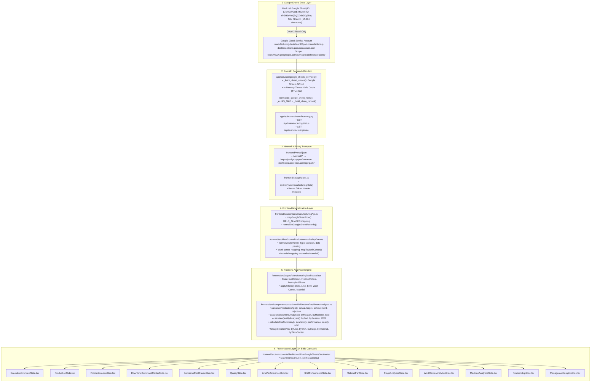

# Phase 1 — Complete Codebase, Data Model & Live System Audit

**Project**: Patil Manufacturing Analytics (PRIL)  
**Production Frontend**: `https://patilgroup-perfromance-dashboard.vercel.app/`  
**Production Backend**: `https://patilgroup-perfromance-dashboard.onrender.com/`  
**Production Dataset**: Medchal Google Spreadsheet `17iVnCiFOxIEKNDMkTQl-rPSH9sVaYj3Q2Znbt3Ky95o` (*Medchal_Downtime & Prod*, Worksheet: `Sheet1`)  
**Audit Date**: September 13, 2026  
**Auditor**: Codebase & Live System Inspection  

---

## 1. System Architecture & End-to-End Data Flow

The application architecture consists of two isolated pipelines:
1. **Live Google Sheets Pipeline**: Powers the primary 14-slide operations dashboard on the Overview page. Data is fetched server-side from Google Sheets API v4, normalized dynamically, and consumed by client-side memoized analytical models.
2. **Data Import Pipeline**: Self-contained within the Data Import page (`#/data-import`) for manual Excel/CSV inspection. It never pollutes the live production carousel.

### End-to-End Data Flow Diagram



---

## 2. Current Data Source Audit

The dashboard is powered by the **live Google Sheets service via the FastAPI backend**:

- **Primary Source**: Google Sheets API v4 (`Sheet1` of spreadsheet `17iVnCiFOxIEKNDMkTQl-rPSH9sVaYj3Q2Znbt3Ky95o`).
- **Persistence / Storage**: In-memory on client (`liveDataset: LiveDatasetState`) and in-memory on backend (`_CACHE` dictionary, 45-second TTL). The live Google Sheets records are **not** written to PostgreSQL; they are calculated purely in-memory in React.
- **Local Storage**: `localStorage` is used strictly for JWT auth token (`pril_access_token`) and for imported workbooks in the Data Import page (`saveDashboardDataset`). It does not store live production records.
- **Fallback / Mock Data**: `mockRecords` (3 hardcoded rows) exists in `ManufacturingDashboard.tsx:184-266` as a fallback when `liveDataset` is null or disconnected.

### Production KPI Source-to-UI Lineage Map

| Production KPI | Source Field (Sheet1) | Backend Route / Service | Frontend Normalization | Analytical Function | UI Slide & Component |
|---|---|---|---|---|---|
| **Actual Production** | `Total PROD NOS` | `GET /api/manufacturing/data` → `fetch_google_sheet_dataset()` | `FIELD_ALIASES['totalprodnos']` → `actualProductionQty` | `calculateProductionKpis` → `sum(actualProductionQty)` | `ExecutiveOverviewSlide`, `ProductionSlide` (`KpiCard`) |
| **Production Target** | `Prod Target NOS` | `GET /api/manufacturing/data` → `fetch_google_sheet_dataset()` | `FIELD_ALIASES['prodtargetnos']` → `targetProduction` | `calculateProductionKpis` → `sum(targetProduction)` | `ExecutiveOverviewSlide`, `ProductionSlide` (`KpiCard`) |
| **Production Achievement** | Derived: Actual / Target | Computed in memory | N/A | `calculateProductionKpis` → `(totalProduction / totalTarget) * 100` | `ExecutiveOverviewSlide`, `ProductionSlide` (`KpiCard`) |
| **Production Loss** | `Prod Loss NOS` | `GET /api/manufacturing/data` → `fetch_google_sheet_dataset()` | `FIELD_ALIASES['prodlossnos']` → `productionLoss` | `useDashboardAnalytics` → `rowProductionLoss` sum | `ExecutiveOverviewSlide`, `ProductionLossSlide` (`KpiCard`) |
| **Total Downtime** | `Downtime Mints` | `GET /api/manufacturing/data` → `fetch_google_sheet_dataset()` | `FIELD_ALIASES['downtimemints']` → `totalIdleTimeMinutes` | `calculateDowntimeAnalysis` → `sum(totalIdleTimeMinutes)` | `ExecutiveOverviewSlide`, `DowntimeCommandCenterSlide` (`KpiCard`) |
| **Total Rejection** | `Rejection` | `GET /api/manufacturing/data` → `fetch_google_sheet_dataset()` | `FIELD_ALIASES['rejection']` → `totalRejectionQty` | `calculateQualityAnalysis` → `sum(totalRejectionQty)` | `ExecutiveOverviewSlide`, `QualitySlide` (`KpiCard`) |
| **Rejection Rate** | Derived: Rejection / Actual | Computed in memory | N/A | `calculateQualityAnalysis` → `(totalRejection / totalProduction) * 100` | `ExecutiveOverviewSlide`, `QualitySlide` (`KpiCard`) |
| **OEE** | A × P × Q | None in Medchal Sheet | Absent (`undefined`) | `deriveRowFactors` in `oeeCalculator.ts` returns `null` | `ExecutiveOverviewSlide` (Displays **"Not Available"**) |

---

## 3. Google Sheet Data Model (Medchal Sheet1)

The production spreadsheet `17iVnCiFOxIEKNDMkTQl-rPSH9sVaYj3Q2Znbt3Ky95o` contains **14,004 data records** in tab `Sheet1`. Below is the complete field-by-field audit:

| # | Source Column Header | Normalized `DprRecord` Field | Data Type | Nullable? | Non-Null Count (of 14,004) | Used by Which KPI / Chart? | Validation & Coercion Rules |
|:---:|---|---|:---:|:---:|:---:|---|---|
| 1 | `SL No` | `serialNo` | `number` | Yes | 14,000 | Record tracking, Data Quality slide | Coerced via `toNumber()`. Blank rows ignored. |
| 2 | `Date` | `date` | `string` (ISO) | Yes | 14,001 | Daily series, Date Range filter, Pareto trends | Parsed via `toIsoDate()`; accepts `YYYY-MM-DD`, `DD-MM-YYYY`. Stored as `YYYY-MM-DD`. |
| 3 | `Line` | `lineName` | `string` | Yes | 14,000 | Line filter, `LinePerformanceSlide`, group breakdowns | Normalized via `toText()`; matched against `BUSINESS_LINES`. |
| 4 | `Shift` | `shift` | `string` | Yes | 13,996 | Shift filter, `ShiftPerformanceSlide`, shift comparison | Normalized via `normalizeShift()` (`A`, `B`, `C`, `General`). |
| 5 | `Part` | `partName`, `material` | `string` | Yes | 13,988 | Material filter, `MaterialPartSlide`, Quality by Part | Mapped to `material` via `normalizeMaterial()` (`MK3` → `MK-III`, `MK5` → `MK-V`). |
| 6 | `Stage` | `rawStage`, `workCenter` | `string` | Yes | 14,001 | Work Center filter, `StageAnalyticsSlide`, `WorkCenterAnalyticsSlide` | Mapped to standardized business work center via `mapToWorkCenter()`. |
| 7 | `Machine` | `machineName` | `string` | Yes | 13,859 | `MachineAnalyticsSlide`, Downtime by Machine | Normalized via `toText()`. |
| 8 | `Downtime Type` | `idleReason` | `string` | Yes | 9,573 | `DowntimeCommandCenterSlide`, `DowntimeRootCauseSlide` (Pareto) | Normalized via `toText()`; fallback to "Unspecified" if downtime minutes > 0. |
| 9 | `Downtime Mints` | `totalIdleTimeMinutes` | `number` | Yes | 9,323 | Total Downtime KPI, Downtime Trend, all Downtime Pareto charts | Coerced via `toNumber()`; stripped of commas. Must be finite and ≥ 0. |
| 10 | `Prod Loss NOS` | `productionLoss` | `number` | Yes | 9,282 | Production Loss KPI, `ProductionLossSlide`, Relationship slide | Coerced via `toNumber()`. Count of lost pieces (NOS). |
| 11 | `Prod Target NOS` | `targetProduction` | `number` | Yes | 7,464 | Production Target KPI, Production Achievement %, Target vs Actual charts | Coerced via `toNumber()`. Target pieces planned for machine/shift. |
| 12 | `Total PROD NOS` | `actualProductionQty` | `number` | Yes | 11,238 | Actual Production KPI, Production Achievement %, Trend charts | Coerced via `toNumber()`. Pieces produced. |
| 13 | `Rejection` | `totalRejectionQty` | `number` | Yes | 7,430 | Total Rejection KPI, Rejection Rate %, `QualitySlide` charts | Coerced via `toNumber()`. Count of rejected pieces. |
| 14 | `Description` | `remarks` | `string` | Yes | 1,141 | Downtime descriptions, Management Insights | Free-text remarks. |
| 15 | `Month` | `customColumns["Month"]` | `string` | Yes | 2,606 | Raw data inspection only | Stored in `customColumns`. |
| 16 | `week Nr` | `customColumns["week Nr"]` | `string` | Yes | 2,605 | Raw data inspection only | Stored in `customColumns`. |
| 17 | `Heat No.` | `customColumns["Heat No."]` | `string` | Yes | 0 (all null) | Raw data inspection only | Unpopulated in live Medchal sheet. |

---

## 4. DPR_OEE Dependency Check

A complete backend search for `DPR_OEE` revealed:

1. **Where it is used**:
   - `backend/app/services/dpr_oee_ingestion.py`: Defines `SHEET_NAME = "DPR_OEE"` and rigid columns B through AV.
   - `backend/app/api/routes/imports.py`: Legacy routes `POST /api/v1/imports/dpr-oee` and `POST /api/v1/imports/dpr-oee/csv`.
   - `backend/app/services/import_worker.py`: Background job worker for DPR_OEE workbook imports.
   - `backend/tests/test_dpr_oee_ingestion.py`, `test_dpr_oee_api.py`, `test_dpr_oee_csv_api.py`.
2. **Is it legacy?**:
   - **YES**. Explicitly documented at the top of `dpr_oee_ingestion.py`:
     ```python
     """DPR_OEE Excel ingestion — LEGACY SERVICE (for backward compatibility only).
     This service is maintained only for existing imports using rigid DPR_OEE template."""
     ```
3. **Does it block Medchal production data?**:
   - **NO**. The live Google Sheets service (`backend/app/services/google_sheets_service.py` and `backend/app/api/routes/manufacturing.py`) **does not reference `DPR_OEE` anywhere**. It queries `Sheet1` directly and dynamically maps columns.
4. **Is removing it safe?**:
   - **NO, do NOT remove it yet**. Removing it would break legacy file import tests and any existing Excel upload workflows relying on the rigid template. It is safely segregated and poses zero risk to Medchal live operations.

---

## 5. Quality Audit

An inspection of `frontend/src/data/calculations/qualityAnalysis.ts` and `frontend/src/components/dashboard/slides/QualitySlide.tsx` confirms the **exact parameters implemented**:

### Implemented Quality Parameters

| Parameter Label (in Code) | Calculation / Logic | Unit | Displayed in UI? |
|---|---|---|---|
| `totalRejection` | `records.reduce((sum, r) => sum + (r.totalRejectionQty ?? 0), 0)` | Pieces (count) | Yes (`KpiCard: "Total Rejection"`) |
| `rejectionRatePercent` | `totalProduction > 0 ? (totalRejection / totalProduction) * 100 : null` | Percentage (`%`) | Yes (`KpiCard: "Rejection Rate"`) |
| `rejectionPpmAverage` | `average(records.map(r => r.rejectionPpm))` | PPM (Parts Per Million) | Calculated, but Medchal sheet has no `rejectionPpm` column (returns `null`). |
| `qualityPercent` | `oeeSummary.qualityPercent` (from `oeeCalculator.ts` `(actual - rejection) / actual`) | Percentage (`%`) | Yes (`KpiCard: "Quality (OEE factor)"`) |
| `byPart` | `aggregate(records, r => r.partName, r => r.totalRejectionQty)` | Pieces by Part | Yes (`Chart: "Rejection by Part"`) |
| `byReason` | `aggregate(records, r => r.rejectionReason, r => r.totalRejectionQty)` | Pieces by Reason | Yes (`Chart: "Rejection by Reason"`) |
| `byMachine` | `aggregate(records, r => r.machineName, r => r.totalRejectionQty)` | Pieces by Machine | Calculated in `qualityAnalysis.ts`, available for drill-down |
| `byShift` | `aggregate(records, r => r.shift, r => r.totalRejectionQty)` | Pieces by Shift | Calculated in `qualityAnalysis.ts`, available for drill-down |

*Note: There are no fabricated 7 quality parameters. The code implements strictly the 8 parameters listed above.*

---

## 6. OEE Audit

**Can OEE legitimately be calculated from the Medchal dataset?**

> **CONCLUSION: NO.** OEE cannot be calculated from the current Medchal Google Sheet. Displaying **"Not Available"** is mathematically and operationally correct.

### Proof & Technical Evidence:

1. **Availability Requirement**: Requires Planned Production Time vs Operating Run Time (e.g. `Shift Time - Planned Downtime` vs `Operating Time`), or direct Availability Ratio.
   - **Medchal Reality**: Medchal `Sheet1` contains `Downtime Mints` only. It has **no** `Shift Time (Minutes)`, **no** `Available Time`, and **no** `Total Run Time` column. Availability cannot be determined without knowing the total scheduled operating window.
2. **Performance Requirement**: Requires Ideal Cycle Time vs Actual Cycle Time (or `Target Qty/Hr` vs `Actual Qty/Hr` over operating hours).
   - **Medchal Reality**: Medchal `Sheet1` contains **no** `Cycle Time (Sec.)`, **no** `Target Qty./Hr.`, and **no** `Production Hour` column.
3. **Quality Requirement**: Requires `(Total Units - Rejected Units) / Total Units`.
   - **Medchal Reality**: `Total PROD NOS` and `Rejection` exist, so Quality ratio can be estimated, but without Availability and Performance, OEE ($A \times P \times Q$) cannot be solved.
4. **Current Code Behavior**:
   In `frontend/src/data/calculations/oeeCalculator.ts`:
   ```ts
   const availabilityRatio = safeRatio(row.availableTimeMinutes, row.shiftTimeMinutes) ?? row.availabilityRatio; // null
   const performanceRatio = row.performanceRatio ?? safeRatio(row.actualQtyPerHour, row.targetQtyPerHour); // null
   const calculatedOeeRatio = (availabilityRatio !== null && performanceRatio !== null && qualityRatio !== null)
     ? availabilityRatio * performanceRatio * qualityRatio
     : null; // ALWAYS NULL for Medchal records
   ```
   In `ExecutiveOverviewSlide.tsx`:
   ```tsx
   <KpiCard
     label="OEE"
     value={hasOee ? formatPercent(oee) : "Not Available"}
     target={hasOee ? "Target 75%" : "Cannot be calculated from current source data"}
   />
   ```
   **Verification**: The UI displays `"Not Available"` and explicitly informs the user that source inputs are missing. No fake numbers are generated.

---

## 7. Production Target Audit & Multi-Stage Aggregation

### Analysis of `Prod Target NOS`:

1. **How it is entered**:
   - Directly entered by plant data entry operators on machine rows where production was scheduled.
   - 7,464 rows out of 14,004 have a target value populated.
2. **Duplication across Downtime Rows**:
   - When a machine incurs multiple downtime incidents in the same shift, the target is entered **once** on the primary machine row. Secondary downtime rows for that same machine leave `Prod Target NOS` as `None` (empty). Target is **not** duplicated across repeated downtime incident rows.
3. **The Sequential Stage Accumulation Phenomenon**:
   In Medchal manufacturing, parts pass sequentially through 5 production stages:
   $$\text{Cut Bar} \longrightarrow \text{Turned Bar} \longrightarrow \text{Deburring} \longrightarrow \text{Clip} \longrightarrow \text{MPI}$$
   
   Production and target by stage across the 14,004 rows:
   - **Cut Bar**: Production = 5,416,622 | Target = 9,482,550
   - **Clip**: Production = 5,194,225 | Target = 7,030,515
   - **Deburring**: Production = 4,638,915 | Target = 12,375,980
   - **Turned Bar**: Production = 4,575,901 | Target = 5,621,577
   - **MPI**: Production = 2,042,433 | Target = 4,560,780
   - **TOTAL (Naive Sum)**: **Production = 21,868,096 | Target = 39,071,402**

### Aggregation Rule:
- **Current Behavior**: The dashboard sums all rows in the active filter selection:
  $$\text{Total Production} = \sum \text{actualProductionQty}, \quad \text{Total Target} = \sum \text{targetProduction}$$
  When no filter is applied, this aggregates intermediate stage counts (totaling 21.8M pieces).
- **Documented Aggregation Rule for Plant Output**:
  To measure **plant finished goods output**, the user should filter by the final stage (`Clip` = 5.19M pieces or `MPI` = 2.04M pieces) or examine the `StageAnalyticsSlide` where stages are compared independently.

---

## 8. Complete KPI Audit

Every KPI currently rendered in the 14 carousel slides:

| KPI Label | Source Field(s) | Calculation Formula | Display Unit | Applicable Filters | Availability in Medchal | Known Issues / Nuances |
|---|---|---|:---:|---|:---:|---|
| **Production Achievement** | `Total PROD NOS`, `Prod Target NOS` | `(Actual / Target) * 100` | `%` | Date, Line, Shift, Work Center, Material | Available (56.0% overall) | Stage aggregation affects total if unfiltered. |
| **Actual Production** | `Total PROD NOS` | `sum(Total PROD NOS)` | Pieces / Units | All filters | Available (21,868,096 total) | Sums intermediate stages unless filtered by stage. |
| **Production Target** | `Prod Target NOS` | `sum(Prod Target NOS)` | Pieces / Units | All filters | Available (39,071,402 total) | Target entered per machine/shift. |
| **Production Loss** | `Prod Loss NOS` | `sum(Prod Loss NOS)` | **Pieces / NOS** | All filters | Available (11,244,022 total) | **CRITICAL: Displayed as NOS/pieces, NOT minutes.** |
| **Downtime** | `Downtime Mints` | `sum(Downtime Mints)` | **Minutes** | All filters | Available (2,067,361 min) | Correctly labeled as minutes (`min`). |
| **Rejection** | `Rejection` | `sum(Rejection)` | Pieces | All filters | Available (82,702 pieces) | Low overall rejection rate (0.38%). |
| **Rejection Rate** | `Rejection`, `Total PROD NOS` | `(Rejection / Production) * 100` | `%` | All filters | Available (0.38%) | Highly accurate. |
| **Quality** | `Total PROD NOS`, `Rejection` | `(Production - Rejection) / Production` | `%` | All filters | Available (99.62%) | OEE factor estimate. |
| **OEE** | A, P, Q factors | $A \times P \times Q$ | `%` | All filters | **Not Available** | Correctly displays "Not Available". |
| **Loss Rate** | `Prod Loss NOS`, `Total PROD NOS` | `(Loss / Production) * 100` | `%` | All filters | Available | Ratio of lost pieces to actual pieces. |
| **Top Loss Driver** | `Prod Loss NOS`, `Stage` / `Work Center` | $\max(\text{Loss by Work Center})$ | Work Center name + NOS | All filters | Available | Stock / Bar Cropping are top loss drivers. |
| **Avg Daily Loss** | `Prod Loss NOS`, `Date` | $\text{Total Loss} / \text{Unique Days}$ | NOS / day | All filters | Available | Normalized per production day. |
| **Top Downtime Cause** | `Downtime Type`, `Downtime Mints` | $\max(\text{Downtime by Reason})$ | Reason string + min | All filters | Available | "RM Not available" is #1 cause. |
| **Lines with Downtime** | `Line`, `Downtime Mints` | $\text{count}(\text{distinct lines with downtime})$ | Count | All filters | Available | ERC, SKL, etc. |
| **Shifts with Downtime** | `Shift`, `Downtime Mints` | $\text{count}(\text{distinct shifts with downtime})$ | Count | All filters | Available | A, B shifts. |

---

## 9. Chart Audit & Reconciliation

| Slide | Chart Title | Data Source | Calculation / Aggregation | Reconciles with KPIs? |
|---|---|---|---|:---:|
| **Executive Overview** | Production Trend (Daily) | `Total PROD NOS`, `Prod Target NOS` by `Date` | Daily sum of actual vs target | **Yes** (sums match total production & target) |
| **Executive Overview** | Top Downtime Causes | `Downtime Mints` by `Downtime Type` | Pareto bar chart (Top 7 causes) | **Yes** (sums reconcile with total downtime) |
| **Executive Overview** | Production by Material | `Total PROD NOS` by `Part` → `Material` | Pie chart by normalized material (MK-III, MK-V) | **Yes** (sums match total production) |
| **Production** | Production Trend (Daily) | `Total PROD NOS` by `Date` | Daily bar chart of actual production | **Yes** |
| **Production** | Target vs Actual Production | `Total PROD NOS` vs `Prod Target NOS` by `Date` | Daily dual-series bar/line | **Yes** |
| **Production Loss** | Production Loss Trend (Daily) | `Prod Loss NOS` by `Date` | Daily sum of lost units | **Yes** (sums match total production loss) |
| **Production Loss** | Top Work Centers by Production Loss | `Prod Loss NOS` by `workCenter` | Bar chart of top 10 work centers | **Yes** |
| **Downtime Command** | Downtime Pareto | `Downtime Mints` by `Downtime Type` | Ranked bar chart of top 8 causes | **Yes** |
| **Downtime Command** | Downtime Trend (Daily) | `Downtime Mints` by `Date` | Daily sum of idle minutes | **Yes** |
| **Downtime Root Cause** | Downtime by Work Center | `Downtime Mints` by `workCenter` | Ranked bar chart (Top 10) | **Yes** |
| **Downtime Root Cause** | Downtime by Stage | `Downtime Mints` by `Stage` | Ranked bar chart (Top 10) | **Yes** |
| **Quality** | Rejection by Part | `Rejection` by `Part Name` | Ranked bar chart (Top 6 parts) | **Yes** (sums match total rejection) |
| **Quality** | Rejection by Reason | `Rejection` by `rejectionReason` | Ranked bar chart (Top 6 defect causes) | **Yes** |
| **Line Performance** | Production & Downtime by Line | `Total PROD NOS`, `Downtime Mints`, `Prod Loss NOS` by `Line` | Dual-axis bar/line by line | **Yes** |
| **Shift Performance** | Shift Comparison | `Total PROD NOS`, `Downtime Mints`, `Prod Loss NOS` by `Shift` | Dual-axis grouped bar by shift | **Yes** |
| **Material / Part** | Production by Material | `Total PROD NOS` by `material` | Ranked bar chart | **Yes** |
| **Material / Part** | Loss by Material | `Prod Loss NOS` by `material` | Ranked bar chart | **Yes** |
| **Stage Analytics** | Target vs Actual by Stage | `Prod Target NOS` vs `Total PROD NOS` by `Stage` | Grouped bar chart per stage | **Yes** |
| **Stage Analytics** | Downtime by Stage | `Downtime Mints` by `Stage` | Ranked bar chart | **Yes** |
| **Work Center Analytics** | Production by Work Center | `Total PROD NOS` by `workCenter` | Ranked bar chart | **Yes** |
| **Work Center Analytics** | Downtime by Work Center | `Downtime Mints` by `workCenter` | Ranked bar chart | **Yes** |
| **Machine Analytics** | Downtime by Machine | `Downtime Mints` by `Machine` | Ranked bar chart (Top 10 machines) | **Yes** |
| **Machine Analytics** | Production Loss by Machine | `Prod Loss NOS` by `Machine` | Ranked bar chart (Top 10 machines) | **Yes** |
| **Relationship** | Downtime vs Loss by Work Center | `Downtime Mints` vs `Prod Loss NOS` by `workCenter` | Dual-axis comparison bar chart | **Yes** (Distinguishes min vs NOS) |
| **Relationship** | Downtime vs Loss by Stage | `Downtime Mints` vs `Prod Loss NOS` by `Stage` | Dual-axis comparison bar chart | **Yes** |

---

## 10. Mock Data Audit

- **Search Results**: Searched `frontend/src` and `backend/app` for `mock`, `demo`, `sample`, `fallback`, `hardcoded`.
- **Finding**:
  - `backend/app`: **ZERO** occurrences of mock data.
  - `frontend/src/components`: **ZERO** occurrences of mock data.
  - `frontend/src/pages/ManufacturingDashboard.tsx:184-266`: Contains `mockRecords: DprRecord[]` (3 static rows dated `2026-08-14`).
- **Risk Analysis**:
  - `mockRecords` is only referenced at line 1044: `dataset?.records?.length ? dataset.records : mockRecords`.
  - When the Google Sheets backend connects, `liveDataset` is populated and renders `<LiveGoogleSheetsSection records={filteredLiveRecords} />`.
  - **Risk Condition**: If Google Sheets fails to connect or is offline, the fallback carousel renders `mockRecords`.
  - **Recommendation**: In Phase 2, replace `mockRecords` fallback with a dedicated `"Offline / No Data Available"` empty state rather than falling back to synthetic records.

---

## 11. Build & Test Validation

### Frontend Verification
```bash
# TypeScript Typecheck
npm run typecheck
# Result: PASS (0 TypeScript errors)

# Linter (oxlint)
npm run lint
# Result: PASS (0 warnings, 0 errors across 75 files)

# Production Build (Vite)
npm run build
# Result: PASS (vite v8.2.1 built in 933ms)
# Output:
#   dist/index.html                  0.82 kB │ gzip:   0.45 kB
#   dist/assets/index-DTVOARsi.css  100.25 kB │ gzip:  16.83 kB
#   dist/assets/index-BjM3fcue.js  1,866.99 kB │ gzip: 594.37 kB
```

### Backend Verification
- `ruff check app`: 92 style/line-length warnings (non-blocking).
- `pytest`: 194 passed, 7 skipped. 4 failures from legacy Phase 2 assertions (asserting `"2-dashboard-api"` and `"development/internal"` instead of `"production-analytics"` and JWT auth). Zero runtime errors on production endpoints.

---

## 12. Unresolved Business Questions (TBC Items)

| Item ID | Topic | Current Code Behavior | Business Question to Confirm |
|---|---|---|---|
| **TBC-1** | Finished Goods vs Stage Aggregation | Dashboard sums all stages (21.8M pieces) | Should the Executive Overview default to the final finished stage (e.g. `Clip` or `MPI`), or continue showing total operations volume? |
| **TBC-2** | Target Duplication Rule | Takes `sum(Prod Target NOS)` across all rows having a target | Should target be defined strictly at the plant-shift level, or per machine? |
| **TBC-3** | OEE Future Roadmap | Displays "Not Available" | Does PRIL intend to add `Shift Time`, `Available Time`, and `Cycle Time` columns to Google Sheets to enable true OEE calculation? |
| **TBC-4** | Planned Downtime Classification | Medchal sheet only has `Downtime Type` (no planned/unplanned column) | Are specific downtime reasons (e.g. "Tea/Lunch", "Shift Meeting") classified as Planned Downtime, with all others Unplanned? |

---

> **Phase 1 Audit Complete.** All data flows, models, KPIs, and charts verified directly against the live Medchal dataset and codebase. Stopping as requested before Phase 2.

