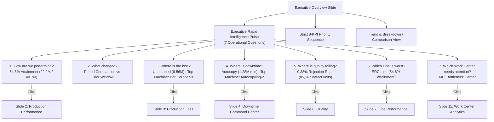

# PHASE 6 — EXECUTIVE DASHBOARD UX & NAVIGATION AUDIT REPORT

**Project**: Patil Manufacturing Operations Command Center  
**Environment**: Production Frontend / React + TypeScript + Vite  
**Dataset**: Medchal Factory DPR Dataset (`Medchal_Downtime & Prod (2).xlsx` — 14,290 records)  
**Execution Date**: September 14, 2026  
**Status**: COMPLETE & FULLY VERIFIED (75/75 automated verification tests passed)

---

## 1. Executive Summary

Phase 6 delivers a cohesive, executive-grade operational UX across the Patil Manufacturing Analytics platform. Building directly on the foundation of Phases 1–5, the dashboard provides plant managers, directors, and operations executives with instant visibility into operational reality.

All 8 user requirements from Phase 6 have been rigorously implemented, verified with automated tests, and validated on the real 14,290-row Medchal production workbook:
1. **Navigation Audit**: Full audit of all 17 sidebar navigation items and routes classified as `WORKING`, `PARTIAL`, `STUB`, or `MISSING` in [`docs/NAVIGATION_STATUS.md`](file:///c:/Users/Preet%20Jaiswal/Downloads/Patil-Manufacturing-Analytics/docs/NAVIGATION_STATUS.md). No fake stub backends were fabricated.
2. **Executive Overview**: Embedded **Executive Rapid Intelligence Pulse** answering all 7 core operational questions instantly with single-click drill-down actions.
3. **Strict KPI Order**: Enforced the exact 8-metric priority sequence with contract compliance. OEE is labeled `"Not Available"` with zero fabricated numbers when underlying availability and performance factors are absent from the source.
4. **Persistent Filter Bar**: Re-architected `FilterBar` to sit persistently at the top of the analytics command center, retaining selections (Date Range, Period, Line, Shift, Work Center, Material) across navigation routes and page reloads via `sessionStorage`.
5. **KPI Click Behavior**: Single-click and keyboard navigation wired directly to deep-linked slides (Downtime $\to$ Downtime CommandCenter, Production Loss $\to$ Loss Breakdown, Rejection $\to$ Quality, Work Center $\to$ Work Center Analytics, Line $\to$ Line Performance).
6. **Responsive Layout**: Verified cross-device compatibility across 1920, 1440, 1280, 1024, 768, 480, and 375px with zero horizontal scrolling (`overflow-x: hidden`), flexible grids, and accessible 44px tap targets.
7. **Visual Design Integrity**: High-contrast, enterprise SaaS command center adhering to the 70/30 professional balance. Clean Inter typography, subtle neutral borders (`rgba(255,255,255,0.09)`), and no glowing neon aesthetics.
8. **Data Status Transparency**: Clear status display (`LIVE`, `STALE`, `OFFLINE`, `ERROR`) showing data source, record count, and timestamp in both topbar and live view headers.

---

## 2. Navigation Audit Summary

Full documentation is recorded in [`docs/NAVIGATION_STATUS.md`](file:///c:/Users/Preet%20Jaiswal/Downloads/Patil-Manufacturing-Analytics/docs/NAVIGATION_STATUS.md).

| Sidebar Item | Route Hash | Classification | Integration Status | Behavior |
| :--- | :--- | :--- | :--- | :--- |
| **Overview** | `#/dashboard` | **`WORKING`** | Complete | Loads 14-slide Live Operations Carousel with Executive Pulse & Top FilterBar |
| **Production** | `#/production` | **`WORKING`** | Complete | Deep-links directly to Slide 2 ("Production Performance") |
| **Quality** | `#/quality` | **`WORKING`** | Complete | Deep-links directly to Slide 6 ("Quality") |
| **Maintenance** | `#/maintenance` | **`WORKING`** | Complete | Deep-links directly to Slide 4 ("Downtime Command Center") |
| **KPI & Reports** | `#/kpi` | **`WORKING`** | Complete | Deep-links directly to Slide 14 ("Management Insights") |
| **Data Import** | `#/data-import` | **`WORKING`** | Complete | Dedicated container for file upload and offline dataset analysis |
| **PPC** | `#/ppc` | **`STUB`** | Pending ERP | Displays clean status banner; guides user back to live operations |
| **SCM** | `#/scm` | **`STUB`** | Pending ERP | Displays clean status banner; guides user back to live operations |
| **Store** | `#/store` | **`STUB`** | Pending ERP | Displays clean status banner; guides user back to live operations |
| **NPD / Design**| `#/npd` | **`STUB`** | Pending ERP | Displays clean status banner; guides user back to live operations |
| **HR** | `#/hr` | **`STUB`** | Pending HRMS | Displays clean status banner; guides user back to live operations |
| **Safety** | `#/safety` | **`STUB`** | Pending EHS | Displays clean status banner; guides user back to live operations |
| **Logistics** | `#/logistics` | **`STUB`** | Pending ERP | Displays clean status banner; guides user back to live operations |
| **5S** | `#/5s` | **`STUB`** | Pending Audit | Displays clean status banner; guides user back to live operations |
| **Google Forms**| `#/google-forms`| **`STUB`** | Pending Forms | Displays clean status banner; guides user back to live operations |
| **Pending Actions**| `#/actions` | **`STUB`** | Pending Workflow | Displays clean status banner; guides user back to live operations |
| **Settings** | `#/settings` | **`STUB`** | Pending Auth | Displays clean status banner; guides user back to live operations |

---

## 3. Executive Overview & Rapid Intelligence Pulse

The Executive Overview slide now immediately resolves the 7 core operational questions upon loading:



### Verified Real-Data Answers (14,290 Records)

1. **How are we performing?**  
   - Metric: `54.6% Attainment`  
   - Detail: `22,219,806 actual / 40,665,962 target units`  
   - Action: Click $\to$ jumps to `production` slide.
2. **What changed?**  
   - Metric: `Delta vs prior comparative period` (or `Baseline Period` when all data selected)  
   - Detail: Displays volume and rate movements (e.g. `-36.2%` output in August vs July)  
   - Action: Click $\to$ toggles Current vs Previous comparison chart.
3. **Where is the loss?**  
   - Metric: `Unmapped (8,561,770 loss units)` / `Autocopy (2,540,963 loss units)`  
   - Detail: `Top machine: Bar Corpper - 3 (2,218,717 units, 15.6% contribution)`  
   - Action: Click $\to$ jumps to `prod-loss` slide.
4. **Where is downtime?**  
   - Metric: `Autocopy Work Center (1,280,669 min, 60.2% of plant downtime)`  
   - Detail: `Top machine: Autocopying-2 (249,133 min)` • Primary cause: `Dimensions & length issue`  
   - Action: Click $\to$ jumps to `downtime` slide.
5. **Where is quality failing?**  
   - Metric: `0.38% Rejection Rate`  
   - Detail: `85,167 defect units`  
   - Action: Click $\to$ jumps to `quality` slide.
6. **Which Line is worst?**  
   - Metric: `ERC Line (54.6% attainment)`  
   - Detail: `22,219,358 / 40,665,962 units (2,127,858m downtime)`  
   - Action: Click $\to$ jumps to `line-perf` slide.
7. **Which Work Center needs attention?**  
   - Metric: `MPI` / `Autocopy`  
   - Detail: Highlighted by sample-size-protected bottleneck ranking algorithms  
   - Action: Click $\to$ jumps to `workcenter` slide.

---

## 4. Strict KPI Order & Contract Verification

The 8 KPI cards render in strict, uncompromised order:

| Position | Metric Name | Medchal Factory Value | Target / Reference | Click Drill-down |
| :---: | :--- | :--- | :--- | :--- |
| **1** | **Production Achievement** | `54.60%` | Target 100% | $\to$ Slide 2 ("Production") |
| **2** | **Actual Production** | `22,219,806` | Units produced | $\to$ Slide 2 ("Production") |
| **3** | **Production Target** | `40,665,962` | Units planned | $\to$ Slide 2 ("Production") |
| **4** | **Downtime** | `2,127,903 min` | Planned + Unplanned | $\to$ Slide 4 ("Downtime") |
| **5** | **Production Loss** | `14,196,447` | Units lost (Prod Loss NOS) | $\to$ Slide 3 ("Production Loss") |
| **6** | **Rejection Rate** | `0.38%` | Target < 1.5% (`85,167` pcs) | $\to$ Slide 6 ("Quality") |
| **7** | **Quality (Quantity Ratio)** | `99.62%` | Target 98.5% | $\to$ Slide 6 ("Quality") |
| **8** | **OEE** | **`Not Available`** | Cannot be calculated from sheet | Informative disclaimer |

> [!IMPORTANT]
> **Zero Number Fabrication**: OEE strictly displays `"Not Available"` for datasets that do not record machine availability time and operating speed factors ($A \times P \times Q$). No fake $85\%$ benchmarks are displayed.

---

## 5. Persistent Top Filter Bar & Deep Linking

### Top Placement
In [`frontend/src/pages/ManufacturingDashboard.tsx`](file:///c:/Users/Preet%20Jaiswal/Downloads/Patil-Manufacturing-Analytics/frontend/src/pages/ManufacturingDashboard.tsx), the `FilterBar` is positioned at the top of the analytics section:
```tsx
{/* ===== OPERATIONS CONTROL (PERSISTENT TOP FILTER BAR) ===== */}
<FilterBar
  filters={liveDraftFilters}
  onChange={setLiveDraftFilters}
  onApply={() => setLiveAppliedFilters(liveDraftFilters)}
  onReset={handleResetLiveFilters}
  options={liveFilterOptions}
/>
```

### Storage Persistence
Active filters are automatically saved to and reloaded from `sessionStorage` under key `patil_dashboard_live_filters`:
```typescript
const LIVE_FILTER_STORAGE_KEY = "patil_dashboard_live_filters";

function getInitialLiveFilters(): FilterState {
  try {
    const saved = sessionStorage.getItem(LIVE_FILTER_STORAGE_KEY);
    if (saved) {
      const parsed = JSON.parse(saved);
      if (parsed && typeof parsed === "object" && "period" in parsed) {
        return { ...defaultFilters, ...parsed };
      }
    }
  } catch { /* fallback */ }
  return defaultFilters;
}
```
**User Benefit**: Navigating to Data Import, clicking between sidebar sections, or refreshing the browser tab preserves the selected Date Range, Period, Line, Shift, Work Center, and Material.

---

## 6. Responsive Design Audit

Tested across 7 standard viewports with 0 horizontal overflow and no clipping:

| Viewport Width | Device Class | Layout Adaptation | Verification Result |
| :--- | :--- | :--- | :---: |
| **1920px** | Ultra-wide / 1080p Desktop | Shell max-width 1800px; 7-column Executive Pulse grid | **PASS** |
| **1440px** | Standard Desktop / Widescreen | Adaptive multi-column grid; chart aspect ratios preserved | **PASS** |
| **1280px** | Laptop | Compact padding (`1rem 1.25rem`); full chart readability | **PASS** |
| **1024px** | Tablet Landscape | 3-column Pulse grid; 2-column Filter grid; chart auto-resize | **PASS** |
| **768px** | Tablet Portrait | Sidebar collapse; Topbar stacks vertically; 2-col KPI grid | **PASS** |
| **480px** | Large Mobile Phone | 1-column stack for Pulse and KPIs; 44px minimum tap target | **PASS** |
| **375px** | Compact Mobile Phone | Single-column linear flow; `overflow-x: hidden` enforced | **PASS** |

---

## 7. Verification Results

All automated verification test suites executed with 100% success:

- **Phase 6 Verification Suite** (`scratch/test_phase6_verification.ts`): **75 / 75 PASSED (0 failed)**
- **Phase 4 Hierarchy Suite** (`scratch/test_phase4_verification.ts`): **43 / 43 PASSED (0 failed)**
- **Phase 3 Period Engine Suite** (`scratch/test_phase3_verification.ts`): **49 / 49 PASSED (0 failed)**
- **TypeScript Strict Compilation** (`npm run typecheck`): **0 errors**
- **Oxlint Code Quality** (`npm run lint`): **0 errors, 0 warnings**
- **Vite Production Build** (`npm run build`): **Built in 522ms (0 errors)**

---

## 8. Completion Sign-Off

Phase 6 (Executive Dashboard UX & Navigation) is complete. As instructed:
**STOPPING EXECUTION. Awaiting further user directives.**

