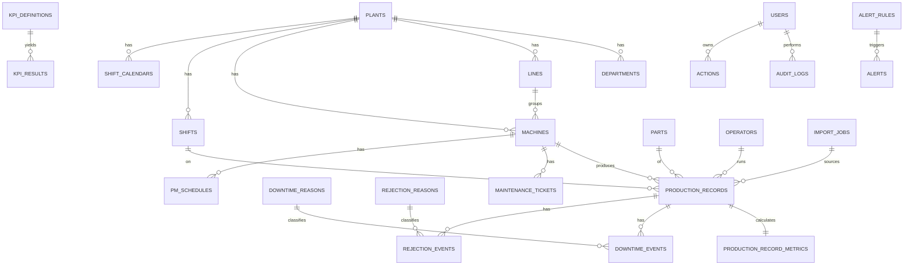

# Patil Manufacturing Analytics — PostgreSQL Database Design

**Phase:** Phase 2 — Stage A (Design & Review Only)  
**Status:** STAGE A REVISION COMPLETE — READY FOR FINAL APPROVAL  
**Date:** 2026-08-10  
**Scope:** Design deliverable only. No tables, migrations, ORM models, seeds, APIs, or application code in this stage.

**Sources analyzed:**
1. `Production Dashboard Data.docx` — intent / department KPIs / illustrative columns  
2. `PRIL_DPR_OEE Sheet - PG_NPD_029.xlsx` — live shop-floor DPR_OEE (source of truth for OEE math)  
3. `docs/PRIL_Dashboard_Master_Specification.md`  
4. `docs/business-confirmations-tbc.md`  
5. Phase 1 scaffold (`frontend/`, `backend/`, `docker-compose.yml`) — inspected only  

**Decision labels used throughout:**
| Label | Meaning |
|---|---|
| **CONFIRMED** | Approved by stakeholder / locked source-of-truth artifact |
| **ASSUMED** | Working assumption needed to design; not a business fact |
| **RECOMMENDED** | Professional design recommendation; not present as a frozen business rule |
| **TBC** | Business confirmation required — not resolved here |

**Non-negotiable:** Excel `DPR_OEE` row formulas are the **CONFIRMED** source of truth for row-level Availability, Performance (AF), Machine Utilisation (AG), Quality, and OEE. Run-Time Performance rollup remains **TBC (Q6)** — proposed default only.

**Open TBCs (unchanged — do not treat as final):** Q1, Q2, Q6, Q11, Q13, Q17, Hosting.

---

## STEP 1 — Excel DPR_OEE Independent Column Mapping

Sheet analyzed independently from the workbook XML: one sheet `DPR_OEE`, title rows 1–2, headers rows 3–4, sample data + formulas from row 5.

### 1.1 Full column map

| Excel Col | Header (exact) | Business Meaning | Proposed Entity | Proposed Field | PostgreSQL Type | Required? | Source | KPI Dependency |
|---|---|---|---|---|---|---|---|---|
| A | S.No. | Display row counter (`=ROW()-3`) | — (not persisted as business key) | — | — | No | XLSX formula | None |
| B | Date | Production / shift attribution date | `production_records` | `production_date` | `DATE` | Yes | XLSX raw | Daily/weekly/monthly OEE rollups; **TBC Q1** for midnight shifts |
| C | Shift | Shift code (e.g. `A`) | `production_records` → FK `shifts` | `shift_id` | `UUID` FK | Yes | XLSX raw → master | Shift OEE, filters |
| D | Machine Name/No. | Machine identifier (e.g. `M001`) | `production_records` → FK `machines` | `machine_id` | `UUID` FK | Yes | XLSX raw → master | Machine OEE, downtime, utilization |
| E | Start Time | Shift/run start instant | `production_records` | `start_at` | `TIMESTAMPTZ` | Yes | XLSX Date (B) + Start Time (E) combined at ingestion | Shift Time (G), Available Time |
| F | Stop Time | Shift/run end instant | `production_records` | `stop_at` | `TIMESTAMPTZ` | Yes | XLSX Date (B) + Stop Time (F) combined at ingestion; **TBC Q1** for midnight-crossing attribution | Shift Time (G); **TBC Q1** if crosses midnight |
| G | Shift Time (Minutes) | `(Stop−Start)×24×60` | **CALCULATED** `production_record_metrics` | `shift_time_min` | `NUMERIC(12,4)` | Derived | XLSX formula | Available Time, OEE inputs |
| H | Operator Name | Operator who ran the machine | `production_records` → FK `operators` | `operator_id` | `UUID` FK | Yes (nullable only if import allows unknown) | XLSX raw → master | Operator filters; Performance attribution |
| I | Part Name | Part display name (e.g. `RGP`) | `parts` / denorm on record | `part_id` (+ optional snapshot `part_name`) | `UUID` FK | Yes | XLSX raw → master | Part drill-down |
| J | Part No. | Part business code (e.g. `PD001`) | `parts` | `code` | `VARCHAR(64)` | Yes | XLSX raw → master | Part identity |
| K | Cavity | Mould cavity count | `production_records` | `cavity_count` | `NUMERIC(10,2)` | Yes | XLSX raw | Target Qty/Hr (M), Performance |
| L | Cycle Time (Sec.) | Ideal/standard cycle time per shot | `production_records` | `cycle_time_sec` | `NUMERIC(12,4)` | Yes | XLSX raw | Target Qty/Hr (M), Performance |
| M | Target Qty./Hr. (Pcs.) | `3600/(CycleTime/Cavity)` | **CALCULATED** `production_record_metrics` | `target_qty_per_hr` | `NUMERIC(14,4)` | Derived | XLSX formula | Performance (AF), Machine Utilisation (AG) |
| N | Prod. Qty. (Pcs.) | Actual produced quantity | `production_records` | `produced_qty` | `NUMERIC(14,4)` | Yes | XLSX raw | Performance, Quality, OEE, PPM |
| O | Planned Down Time (Tea/Lunch) | Planned stoppage minutes | `production_records` and/or planned downtime events | `planned_downtime_min` | `NUMERIC(12,4)` | Yes (may be 0) | XLSX raw | Available Time; **TBC Q2** categories |
| P | Available Time | `Shift Time − Planned Downtime` | **CALCULATED** `production_record_metrics` | `available_time_min` | `NUMERIC(12,4)` | Derived | XLSX formula | Availability, Machine Utilisation, OEE |
| Q | 1.Manpower Shortage | Unplanned idle minutes | `downtime_events` + `downtime_reasons` | `minutes` | `NUMERIC(12,4)` | No (0 if blank) | XLSX raw | Total Idle, Availability, Pareto |
| R | 2. Mould Trial | Unplanned idle minutes (Excel bucket) | `downtime_events` | `minutes` | `NUMERIC(12,4)` | No | XLSX raw | Same; **TBC Q2** planned vs unplanned |
| S | 3. Bin Shortage | Unplanned idle minutes | `downtime_events` | `minutes` | `NUMERIC(12,4)` | No | XLSX raw | Same |
| T | 4. Material Shortage | Unplanned idle minutes | `downtime_events` | `minutes` | `NUMERIC(12,4)` | No | XLSX raw | Same |
| U | 5. M/c Under BD | Unplanned idle / breakdown minutes | `downtime_events` | `minutes` | `NUMERIC(12,4)` | No | XLSX raw | Same + Maintenance link |
| V | 6. Nozzle Block | Unplanned idle minutes | `downtime_events` | `minutes` | `NUMERIC(12,4)` | No | XLSX raw | Same |
| W | 7. Mould Problem | Unplanned idle minutes | `downtime_events` | `minutes` | `NUMERIC(12,4)` | No | XLSX raw | Same |
| X | 8. Crystal/ Insert Shortage | Unplanned idle minutes | `downtime_events` | `minutes` | `NUMERIC(12,4)` | No | XLSX raw | Same |
| Y | 9. Power Failure | Unplanned idle minutes | `downtime_events` | `minutes` | `NUMERIC(12,4)` | No | XLSX raw | Same |
| Z | 10. Process Setting | Unplanned idle minutes | `downtime_events` | `minutes` | `NUMERIC(12,4)` | No | XLSX raw | Same |
| AA | 11. Others | Unplanned idle minutes | `downtime_events` | `minutes` | `NUMERIC(12,4)` | No | XLSX raw | Same |
| AB | Total Idle Time (Minutes) | `SUM(Q:AA)` | **CALCULATED** `production_record_metrics` | `total_idle_time_min` | `NUMERIC(12,4)` | Derived | XLSX formula | Availability, Run Time |
| AC | Total Run Time (Minutes) | `Available − Total Idle` | **CALCULATED** `production_record_metrics` | `run_time_min` | `NUMERIC(12,4)` | Derived | XLSX formula | Availability, Performance, OEE |
| AD | Availability Ratio (A) | `Run Time / Available Time` | **CALCULATED** `production_record_metrics` | `availability` | `NUMERIC(12,8)` | Derived | XLSX formula | OEE |
| AE | Actual Qty./ Hr. | `Prod Qty / Run Time × 60` | **CALCULATED** `production_record_metrics` | `actual_qty_per_hr` | `NUMERIC(14,4)` | Derived | XLSX formula | Performance |
| AF | Operator Efficiency (Performance Ratio) - (P) | `Actual Qty/Hr ÷ Target Qty/Hr` | **CALCULATED** `production_record_metrics` | `performance` | `NUMERIC(12,8)` | Derived | XLSX formula | **OEE Performance term** |
| AG | Machine Efficiency (Machine Utilisation) | `Prod Qty / (Available Hrs × Target Rate)` | **CALCULATED** `production_record_metrics` | `machine_utilisation` | `NUMERIC(12,8)` | Derived | XLSX formula | Parallel KPI — **not** OEE P term |
| AH–AQ | Rejection reasons A–J | Rejection qty by reason | `rejection_events` + `rejection_reasons` | `qty` | `NUMERIC(14,4)` | No | XLSX raw | Total Rejection, Quality, PPM, Pareto |
| AR | Total Rejection (Pcs Qty.) | `SUM(AH:AQ)` | **CALCULATED** `production_record_metrics` | `total_rejection_qty` | `NUMERIC(14,4)` | Derived | XLSX formula | Quality, PPM |
| AS | Rejection PPM | `Total Rejection / Prod Qty × 1e6` | **CALCULATED** `production_record_metrics` | `rejection_ppm` | `NUMERIC(14,4)` | Derived | XLSX formula | Quality KPI |
| AT | Quantity Ratio (Q) | `(Prod − Rejection) / Prod` | **CALCULATED** `production_record_metrics` | `quality` | `NUMERIC(12,8)` | Derived | XLSX formula | OEE |
| AU | OEE (A*P*Q) | `AD × AF × AT` | **CALCULATED** `production_record_metrics` | `oee` | `NUMERIC(12,8)` | Derived | XLSX formula | Primary OEE |
| AV | Any Other Remarks | Free-text notes | `production_records` | `remarks` | `TEXT` | No | XLSX raw | Audit / context |

**Rejection reason codes (CONFIRMED from Excel row 4):**  
A Short Moulding, B Shrinkage Mark, C Silver Streak, D Flow Mark, E Weld Line, F Dent Mark, G Power Cut, H Black Marks, I Crack Marks, J Others.

### 1.2 RECOMMENDED ADDITION fields (needed but absent from Excel)

| Proposed Field | Entity | Why | Label |
|---|---|---|---|
| `id` (UUID PK) | all entities | Stable surrogate key | RECOMMENDED |
| `plant_id` | production + masters | Multi-plant readiness; seed Medchal only | RECOMMENDED / **TBC Q11** |
| `line_id` | machines (nullable) | Line rollups when mapping known | RECOMMENDED / **TBC Q13** |
| `shift_date_attribution_rule` | config | Midnight-crossing policy | **TBC Q1** placeholder |
| `source_import_id` | production_records | Lineage to import batch | RECOMMENDED |
| `status` / approval fields | production_records | Supervisor sign-off before official KPIs | RECOMMENDED |
| `custom_fields` JSONB | production_records | DOCX customizable columns (Heat No., Stage, etc.) | RECOMMENDED |
| `heat_no` | custom field or column | Present in DOCX illustrative table, not Excel | RECOMMENDED / optional |
| `created_at` / `updated_at` / `created_by` | transactional tables | Auditability | RECOMMENDED |
| Aggregation component sums | `oee_snapshots` | RATIO-OF-SUMS rollups without averaging % | RECOMMENDED / **TBC Q6** |

---

## STEP 2 — Core Master Data (include / exclude)

### 2.1 Include (justified)

| Entity | Purpose | Justification | Label |
|---|---|---|---|
| `plants` | Site / plant scope | DOCX multi-dept plant view; Q11 multi-plant schema support | RECOMMENDED; seed Medchal only (**TBC Q11**) |
| `departments` | Org / RBAC / KPI ownership | DOCX department dashboards | CONFIRMED intent (DOCX) |
| `lines` | Optional machine grouping | DOCX illustrative “Line”; Excel has none | RECOMMENDED; mapping **TBC Q13** |
| `machines` | Asset identity for DPR | Excel col D | CONFIRMED (XLSX) |
| `machine_types` | Classify moulding vs other | Supports non-hardcoded process types | RECOMMENDED |
| `machine_statuses` | Active / BD / idle catalog | Maintenance + filters | RECOMMENDED |
| `operators` | Operator master (not free text) | Excel col H free text → DQ risk | CONFIRMED need (XLSX) + RECOMMENDED master |
| `shifts` | Named shifts + times | Excel col C | CONFIRMED need + RECOMMENDED master |
| `shift_calendars` | Working days / holidays / pattern | Monthly targets, planned days | RECOMMENDED |
| `parts` | Part No + Part Name + defaults | Excel I/J/K/L | CONFIRMED need (XLSX) |
| `downtime_reasons` | Catalog of idle reasons | Excel Q–AA | CONFIRMED (XLSX) |
| `rejection_reasons` | Catalog of rejection reasons | Excel AH–AQ | CONFIRMED (XLSX) |

### 2.2 Exclude or defer (with reason)

| Candidate | Decision | Why |
|---|---|---|
| Area | **Exclude MVP** | Not in Excel; Line already TBC. Avoid inventing hierarchy. |
| Work Center | **Exclude MVP** | No source evidence; ERP-style concept without data. |
| Product / Product Family | **Defer** | Excel uses Part only; Product Family would invent taxonomy. |
| Customer | **Defer to Quality module** | Needed for complaints later; not on DPR_OEE. Thin stub OK in later migration. |
| Supplier | **Defer to SCM** | No Excel supplier fields; inventing stores master without source is unjustified for core OEE. |
| Process / Operation / Routing | **Exclude MVP** | No routing sheet; process type ASSUMED injection moulding but must not hard-code. |
| Work Order | **Exclude MVP** | Not in Excel/DOCX as operational key; PPC uses plan horizon instead. |

---

## STEP 3 — Production Data: RAW vs CALCULATED

### 3.1 RAW OPERATIONAL DATA (system of record inputs)

| Entity | Contents |
|---|---|
| `production_records` | production_date, shift, machine, operator, part, start_at/stop_at (TIMESTAMPTZ), cavity, cycle_time, produced_qty, planned_downtime_min, remarks, custom_fields, source, approval status |
| `downtime_events` | production_record_id, downtime_reason_id, minutes (one row per reason with minutes > 0, or zero-fill policy RECOMMENDED: store only non-zero) |
| `rejection_events` | production_record_id, rejection_reason_id, qty |

**ASSUMED:** One `production_records` row = one Machine + Shift + Date + Part combination (Excel practice; mid-shift part change = second row).

### 3.2 CALCULATED KPI DATA (never treat as primary input)

| Entity | Contents | Recalc trigger |
|---|---|---|
| `production_record_metrics` | G, M, P, AB–AG, AR–AU equivalents for that row | On insert/update of raw row or child events |
| `oee_snapshots` | Precomputed rollups by scope × period with **component sums** for RATIO-OF-SUMS | After row metrics change; **aggregation rule TBC Q6** |
| `kpi_results` | Non-OEE KPI snapshots from `kpi_definitions` | Per definition schedule / event |

**CONFIRMED rule:** Dashboards must not re-implement Excel formulas ad hoc; one engine owns math matching Excel for row-level.

---

## STEP 4 — Downtime Design

### 4.1 Model

```
downtime_reasons (master)
  id, code, label,
  category VARCHAR  -- configurable business value (e.g. planned / unplanned);
                    -- NOT a PostgreSQL ENUM (Q2 TBC; catalog must remain editable)
  is_active, sort_order, excel_column (nullable)
  -- Optional later: FK to a downtime_categories lookup table if PRIL wants
  -- a closed but still admin-editable catalog without ENUM coupling.

downtime_events (raw fact)
  id, production_record_id → production_records
  downtime_reason_id → downtime_reasons
  minutes NUMERIC
  UNIQUE(production_record_id, downtime_reason_id)
```

**Design rule (RECOMMENDED):** Prefer `VARCHAR` / text + application or lookup-table validation for business-configurable classifiers. Do **not** use PostgreSQL `ENUM` types for values that may change when TBCs (especially Q2) are resolved.

### 4.2 Links

| Link | How |
|---|---|
| **Availability** | `total_idle = Σ unplanned minutes`; `run_time = available − total_idle`; `A = run_time / available` (**CONFIRMED** Excel) |
| **Production loss** | Optional derived: loss units ≈ idle_min/60 × target_qty_per_hr (**RECOMMENDED** display metric; not an Excel column) |
| **OEE** | Via Availability component only at row level |
| **Maintenance** | Reason `M/c Under BD` (and similar) may spawn / link `maintenance_tickets` (**RECOMMENDED**); not automatic without business rule |

### 4.3 TBC

- **Q2:** Which reasons are planned vs unplanned (Excel treats Tea/Lunch as planned column O; Mould Trial currently under unplanned Q–AA). Design stores `category` as configurable — do not hard-finalize.

---

## STEP 5 — Quality Design

### 5.1 From Excel (in-process rejection)

```
rejection_reasons (master) — A–J from Excel
rejection_events (raw) — qty per reason per production_record
production_record_metrics.quality / rejection_ppm / total_rejection_qty — calculated
```

### 5.2 Beyond Excel (DOCX Quality KPIs) — design stubs for later migrations

| Entity | Purpose | Label |
|---|---|---|
| `quality_inspections` | In-process / final inspection lots | RECOMMENDED (DOCX KPIs) |
| `customer_complaints` | Customer PPM / complaints | RECOMMENDED (DOCX) |
| `actions` (CAPA) | Corrective/preventive from quality events | RECOMMENDED (DOCX Top 10 Actions) |

### 5.3 Links

| Link | How |
|---|---|
| Quality % / OEE Q | `(produced − total_rejection) / produced` (**CONFIRMED** Excel AT) |
| Production | FK from rejection_events → production_records |
| Actions | Polymorphic `actions.source_module = 'quality'|'rejection'` |

---

## STEP 6 — Maintenance Model (design only)

| Entity | Purpose | Label |
|---|---|---|
| `maintenance_tickets` | Breakdown / corrective work orders linked to machine (± production_record / downtime_event) | RECOMMENDED (DOCX MTTR/MTBF) |
| `pm_schedules` | Preventive schedule per machine | RECOMMENDED |
| `pm_completions` | PM done vs due | RECOMMENDED |

**Derived KPIs (not stored formulas in Excel):** MTTR, MTBF, PM completion % — computed by KPI engine from tickets/schedules.

---

## STEP 7 — PPC / Planning

| Entity | Purpose | Label |
|---|---|---|
| `production_plans` | Plan for horizon n / n+1 / n+2 by part (± machine/line), plan_qty, plan_date | RECOMMENDED (DOCX PPC) |
| `material_availability_checks` | Optional plan support | RECOMMENDED / thin |

**Exclude:** Full MRP/BOM explosion, work-order MES — no source artifact justifying MVP complexity.

Plan vs Actual = join plans to Σ `production_records.produced_qty` for matching grain.

---

## STEP 8 — Inventory / SCM / Stores (justified only)

| Entity | Include? | Reason |
|---|---|---|
| `materials` | Later / thin stub | DOCX SCM KPIs; no Excel columns |
| `inventory_snapshots` | Later | FG stock / reorder — DOCX only |
| `grn_records` | Later | DOCX GRN |

**Do not create rich inventory schema in Migration 001** merely because SCM is a department name. Stage migrations after Production/OEE core.

---

## STEP 9 — Logistics (justified only)

| Entity | Include? | Reason |
|---|---|---|
| `dispatch_records` | Later | DOCX Delivery Accuracy |
| `customers` | Later with complaints/dispatch | Not on DPR |

Same staging rule as Step 8.

---

## STEP 10 — Centralized Flexible KPI Architecture

### 10.1 Definitions (configuration)

```
kpi_definitions
  id, code, name, department_id, description
  unit
  formula_key           -- stable key into versioned backend calculation registry
  formula_version       -- integer/semver of the registered calculator implementation
  aggregation_method    -- SUM | RATIO_OF_SUMS | COUNT | LATEST | WAVG
                        -- (VARCHAR + app/check validation; not a PG ENUM)
  target, warning_threshold, critical_threshold
  weight                -- Q17 TBC; admin-configurable
  frequency, owner_role_id
  version, effective_from, effective_to, is_active
```

**Design rule (RECOMMENDED):** KPI math is executed only by **versioned backend calculation logic** keyed by `formula_key` + `formula_version`. Do **not** store or execute user-entered `formula_expression` as SQL (or any other executable expression). Configuration selects which registered calculator runs; it does not author SQL.

**CONFIRMED:** Overall KPI points formula from DOCX:  
`Overall KPI (%) = Total Achieved KPI Points / Total KPI Target Points × 100`  
**Weights: TBC Q17** — equal weights as configurable placeholder only.

### 10.2 Results storage strategy

| Layer | Strategy | When |
|---|---|---|
| Row OEE A/P/Q/OEE/AG | **Precomputed** on `production_record_metrics` | On every raw change |
| Day/week/month × machine/line/plant | **Precomputed** `oee_snapshots` with stored component sums | After affected rows change |
| Ad-hoc custom date ranges | **On-demand** RATIO-OF-SUMS over component sums or raw metrics | API query |
| Materialized views | **Optional** for heavy dashboards | RECOMMENDED after volume justifies |

**Never** average stored OEE percentages for rollups unless PRIL explicitly chooses that under Q6 (currently TBC; proposed default = ratio-of-sums).

---

## STEP 11 — OEE Model (Excel formulas) + Aggregation

### 11.1 Row-level (CONFIRMED — Excel)

```
shift_time_min       = (stop_at − start_at) in minutes   -- Excel: (Stop−Start)×24×60; midnight attribution: TBC Q1
available_time_min   = shift_time_min − planned_downtime_min
total_idle_time_min  = Σ unplanned downtime minutes
run_time_min         = available_time_min − total_idle_time_min

availability         = run_time_min / available_time_min          -- AD
target_qty_per_hr    = 3600 / (cycle_time_sec / cavity_count)  -- M
actual_qty_per_hr    = produced_qty / run_time_min × 60         -- AE
performance          = actual_qty_per_hr / target_qty_per_hr    -- AF (OEE P)
machine_utilisation  = produced_qty / (available_time_min/60 × target_qty_per_hr)  -- AG
total_rejection_qty  = Σ rejection qtys                         -- AR
rejection_ppm        = total_rejection_qty / produced_qty × 1e6 -- AS
quality              = (produced_qty − total_rejection_qty) / produced_qty  -- AT
oee                  = availability × performance × quality     -- AU
```

**Ingestion note (timestamps):** Excel columns E/F are time-of-day values. During ingestion they are combined with Excel Date (B) into `start_at` / `stop_at` (`TIMESTAMPTZ`). `production_date` (`DATE`) is stored separately for business/shift attribution. How midnight-crossing runs map to `production_date` remains **TBC Q1**.

### 11.2 Aggregation (TBC Q6 — proposed default only)

**Proposed default (configurable, not final):** RATIO-OF-SUMS using Run Time for Performance rollup:

```
A_period = Σ run_time / Σ available_time
P_period = Σ produced_qty / Σ (run_time/60 × target_qty_per_hr)   -- Run-Time weighted
Q_period = Σ (produced − rejection) / Σ produced
OEE_period = A_period × P_period × Q_period
```

| Dimension | Grain | Notes |
|---|---|---|
| Machine × Shift × Day × Part | Atomic row | CONFIRMED |
| Machine × Day | Sum components across shifts/parts | Proposed |
| Line × Day | Needs machine→line map | **TBC Q13** |
| Plant × Day/Week/Month | Sum across machines | Plant scope **TBC Q11** |
| Week / Month | Calendar boundaries plant-local | ASSUMED ISO week unless PRIL specifies |

### 11.3 `oee_snapshots` scope design (single approach)

**Chosen design:** polymorphic scope via `scope_type` + `scope_id` — **not** parallel explicit `plant_id` / `line_id` / `machine_id` columns on the snapshot row.

```
oee_snapshots
  id
  scope_type VARCHAR          -- e.g. machine | line | plant (app/check validated; not PG ENUM)
  scope_id UUID               -- FK target depends on scope_type (machines.id / lines.id / plants.id)
  period_type VARCHAR         -- e.g. day | week | month (app/check validated; not PG ENUM)
  period_start DATE/TIMESTAMPTZ
  -- component sums for RATIO-OF-SUMS:
  sum_run_time_min, sum_available_time_min, sum_produced_qty,
  sum_good_qty, sum_rejection_qty, sum_run_based_capacity, ...
  availability, performance, quality, oee   -- computed ratios for this grain
  aggregation_rule_version
  UNIQUE(scope_type, scope_id, period_type, period_start, aggregation_rule_version)
```

| `scope_type` | `scope_id` points to | Notes |
|---|---|---|
| `machine` | `machines.id` | Primary shop-floor rollup grain |
| `line` | `lines.id` | Only when line mapping exists (**TBC Q13**) |
| `plant` | `plants.id` | Plant rollups (**TBC Q11** multi-plant) |

**Why this approach:** One uniqueness and index pattern covers all grains; avoids nullable FK sprawl and inconsistent partial indexes. Application (or deferred constraint triggers later) enforces that `scope_id` exists in the table implied by `scope_type`.

---

## STEP 12 — Ingestion & Lineage

| Entity | Purpose |
|---|---|
| `import_jobs` | Batch metadata: source_type (`excel`,`csv`,`form`,`sheets`,`manual`,`api` as VARCHAR), file URI, uploader, status, counts, mapping_config JSONB |
| `import_job_rows` | Optional staging: raw row payload, validation errors, target production_record_id |
| `column_mapping_templates` | Saved Excel/CSV → field maps per department/source |
| `data_sources` | Registry of channels + freshness SLA |

**Lineage:** Every `production_records.source_import_id` (nullable for manual) + `source_type` + optional `external_row_key` for idempotent upserts.

**Timestamp composition (Excel DPR_OEE):** On ingest, combine Excel **Date (B)** with Excel **Start Time (E)** → `start_at TIMESTAMPTZ`, and Date (B) with **Stop Time (F)** → `stop_at TIMESTAMPTZ`. Persist Excel Date also as `production_date DATE` for business/shift attribution. Midnight-crossing shift date attribution remains **TBC Q1** — do not hard-finalize the rule in schema.

**DOCX customizable columns:** Unmapped columns → `custom_fields` JSONB and/or `custom_field_definitions`.

---

## STEP 13 — Auditability

| Entity / Mechanism | Purpose | Label |
|---|---|---|
| `audit_logs` | who, entity_type, entity_id, field, old_value, new_value, reason, at | RECOMMENDED |
| Soft approval on production_records | draft → submitted → approved | RECOMMENDED |
| Immutable audit | No app delete/update of audit rows | RECOMMENDED |
| Correction workflow | Reason required for post-approval edits | RECOMMENDED (DOCX gap) |

---

## STEP 14 — Users / Security (conceptual only — no auth implementation)

| Entity | Purpose |
|---|---|
| `users` | identity, employee_code, email, password_hash (future), plant_id, department_id |
| `roles` | Super Admin, Management, Plant Head, Dept Head, Supervisor, Operator, Engineer, Viewer |
| `role_permissions` | module × action grants |
| `user_roles` | M:N assignment |

**Enforcement (design intent):** Server-side RBAC by `plant_id` / `department_id`. HR/Safety row detail restricted by default (**ASSUMED** sensitive; related Q15 in master spec remains clarification, not in the locked TBC list for this stage).

---

## STEP 15 — Alerts & Actions / CAPA

| Entity | Purpose |
|---|---|
| `alert_rules` | KPI/threshold/freshness rules |
| `alerts` | Fired instances: severity, message, ack, escalate |
| `actions` | CAPA: problem, root_cause, corrective, preventive, owner, priority, status, due, evidence |
| `action_links` | Optional explicit FKs to production/downtime/rejection/maintenance/safety |

Statuses (**RECOMMENDED**): Open → In Progress → On Hold → Completed → Verified → Closed; Overdue derived.

---

## STEP 16 — Historical Data Strategy

| Topic | Recommendation | Label |
|---|---|---|
| Hot retention | 24 months online for production_records + metrics | RECOMMENDED |
| Partitioning | RANGE partition `production_records` / `oee_snapshots` by month when > ~5–10M rows | RECOMMENDED |
| Archival | Cold table or object storage export of old partitions + import file archive | RECOMMENDED |
| KPI versioning | Do not silently rewrite history when `formula_version` / calculator registry version changes; new version from effective_from | RECOMMENDED |
| TimescaleDB | Future IoT only | FUTURE |

---

## STEP 17 — Conceptual ER (cardinality)



**Cardinality notes:**
- Plant 1 → many Machines (Line optional: Machine N → 0..1 Line) — **TBC Q13**
- Production_record 1 → 1 metrics; 1 → many downtime/rejection events
- Machine M ↔ Part N via optional `machine_part_standards` (**RECOMMENDED**) for default cycle/cavity
- `oee_snapshots` are keyed by `scope_type` + `scope_id` (polymorphic to plant/line/machine) × `period_type` + `period_start` — not by parallel explicit plant/line/machine FK columns on the snapshot table

---

## STEP 18 — Normalization Review

| Area | Form | Notes |
|---|---|---|
| Masters vs facts | 3NF | Codes not free-text on facts (FK to masters) |
| Downtime/rejection wide Excel columns | Normalized to event tables | Avoids schema change when reason #12 added |
| Calculated metrics | Separate table or generated columns | Prevents mixing raw/calc; supports recalc |
| Custom DOCX fields | JSONB + definition metadata | Avoids endless ALTER TABLE |
| Denormalization allowed | Snapshot part_name/code on record optional | Import resilience if master renamed |
| oee_snapshots | Controlled denormalization | Dashboard performance |

---

## STEP 19 — Indexing Recommendations

| Table | Index | Purpose |
|---|---|---|
| `production_records` | `(plant_id, production_date, shift_id)` | Day/shift dashboards |
| `production_records` | `(machine_id, production_date, shift_id)` | Machine drill-down (**primary**) |
| `production_records` | `(part_id, production_date)` | Part analysis |
| `production_records` | `(start_at)`, `(stop_at)` | Duration / overlap queries |
| `production_records` | `UNIQUE(machine_id, shift_id, production_date, part_id, start_at)` **RECOMMENDED** | Duplicate guard (tune if business allows multi-rows) |
| `downtime_events` | `(production_record_id)` | Join |
| `rejection_events` | `(production_record_id)` | Join |
| `oee_snapshots` | `UNIQUE(scope_type, scope_id, period_type, period_start, aggregation_rule_version)` | Idempotent upsert (sole scope identity) |
| `oee_snapshots` | `(period_type, period_start, scope_type)` | Period browsing / management views |
| `oee_snapshots` | `(scope_type, scope_id, period_type, period_start DESC)` | Scope drill-down history |
| `import_jobs` | `(created_at DESC)`, `(status)` | Ops |
| `audit_logs` | `(entity_type, entity_id, at DESC)` | Trace |
| `actions` | `(status, due_date)`, `(department_id)` | Top 10 pending |
| `alerts` | `(acknowledged_at NULLS FIRST, severity)` | Inbox |

---

## STEP 20 — Data Volume Scaling

**ASSUMED planning volumes (not measured):**  
~50 machines × 3 shifts × 1–3 parts/day ≈ 150–450 rows/day → ~50k–160k rows/year.  
With 10-year online history still modest for PostgreSQL; partitioning is proactive.

| Risk | Mitigation |
|---|---|
| Wide reason pivots in UI | Aggregate from event tables |
| Dashboard full-table scans | Serve `oee_snapshots` for periods > current shift |
| Import re-processing | Idempotent keys + staging |
| Future IoT high-freq | Separate series store later — not MVP |

---

## STEP 21 — Final Database Proposal (summary)

### 21.1 Entity list by purpose

**Master:** plants, departments, lines, machines, machine_types, machine_statuses, operators, shifts, shift_calendars, parts, downtime_reasons, rejection_reasons, (optional) machine_part_standards  

**Raw production:** production_records, downtime_events, rejection_events  

**Calculated:** production_record_metrics, oee_snapshots, kpi_definitions, kpi_results  

**Ingestion:** import_jobs, import_job_rows, column_mapping_templates, data_sources, custom_field_definitions  

**Maintenance (design):** maintenance_tickets, pm_schedules, pm_completions  

**PPC (design):** production_plans  

**SCM/Logistics (deferred thin):** materials, inventory_snapshots, grn_records, dispatch_records, customers  

**Quality extended:** quality_inspections, customer_complaints  

**Cross-cutting:** users, roles, role_permissions, user_roles, audit_logs, alert_rules, alerts, actions  

**Other DOCX modules (later, not unjustified core):** hr_attendance, safety_incidents, safety_audits, npd_projects, ecr_records, five_s_audits  

### 21.2 Core field sketches (PKs / FKs)

**plants:** `id PK`, code UK, name, timezone, is_active  
**machines:** `id PK`, plant_id FK, line_id FK NULL, code UK(plant), name, machine_type_id, status_id, ideal_cycle_time_sec NULL  
**parts:** `id PK`, code UK, name, default_cavity, default_cycle_time_sec  
**production_records:** `id PK`, plant_id, machine_id, shift_id, operator_id, part_id, `production_date DATE`, `start_at TIMESTAMPTZ`, `stop_at TIMESTAMPTZ`, cavity_count, cycle_time_sec, produced_qty, planned_downtime_min, remarks, custom_fields JSONB, source_import_id NULL, status (VARCHAR), created_by, approved_by NULL  
**production_record_metrics:** `production_record_id PK/FK`, shift_time_min, available_time_min, total_idle_time_min, run_time_min, target_qty_per_hr, actual_qty_per_hr, availability, performance, machine_utilisation, total_rejection_qty, rejection_ppm, quality, oee, computed_at, formula_version  
**oee_snapshots:** `scope_type`, `scope_id`, `period_type`, `period_start`, component sums (run/available/produced/good/rejection + theoretical run-based capacity) + computed ratios + `aggregation_rule_version`; uniqueness on `(scope_type, scope_id, period_type, period_start, aggregation_rule_version)` — no parallel plant_id/line_id/machine_id columns  
**downtime_reasons:** `category VARCHAR` (configurable; **not** PostgreSQL ENUM — **TBC Q2**)  
**kpi_definitions:** `formula_key`, `formula_version` → versioned backend calculator registry only (no executable user-entered expression / SQL)  

### 21.3 Strategy summary

| Concern | Strategy |
|---|---|
| Raw vs calculated | Strict separation; engine owns Excel-equivalent math |
| Audit | audit_logs + approval statuses |
| Historical | Partition + archive; versioned KPI calculators (`formula_key` + `formula_version`) |
| KPI | `kpi_definitions` + results via registered backend logic; **no** user-entered executable expressions; weights **TBC Q17** |
| OEE | Row = Excel; rollup = configurable, default ratio-of-sums **TBC Q6**; snapshots use `scope_type` + `scope_id` |
| Import | Staging → validate → commit → lineage; Date+Time → `start_at`/`stop_at` |
| Security | Conceptual RBAC entities only in Stage A |
| Configurable classifiers | VARCHAR / lookup — avoid PostgreSQL ENUM for business-configurable values (e.g. downtime category) |

---

## STEP 22 — Problems, Conflicts, Risks

| # | Issue | Severity | Mitigation |
|---|---|---|---|
| 1 | DOCX “Line/Stage/Heat No” vs Excel machine-only | Medium | custom_fields + nullable line_id; don’t force Line |
| 2 | AF vs AG both “efficiency” | High confusion | Persist both; OEE uses AF only (**CONFIRMED**) |
| 3 | Mould Trial planned vs unplanned | Medium | **TBC Q2**; category configurable |
| 4 | Midnight shifts | Medium | **TBC Q1**; store `start_at`/`stop_at` TIMESTAMPTZ + separate `production_date`; attribution rule configurable |
| 5 | OEE rollup method unsettled | High | Engine parameterized; **TBC Q6** |
| 6 | Multi-plant unknown | Medium | plant_id everywhere; seed one plant (**TBC Q11**) |
| 7 | Free-text masters in Excel | High DQ | Force FK masters on ingest |
| 8 | Department names ≠ tables | Process risk | Only justify entities with purpose + source |
| 9 | Averaging OEE % in Excel-outside practice | Risk if users expect average | Document ratio-of-sums; confirm Q6 |
| 10 | Hosting unknown | Ops | Cloud-agnostic Docker (**TBC Hosting**) |
| 11 | Duplicate Google Form submissions | Medium | Idempotent business key |
| 12 | Overall KPI weights unset | Medium | Equal placeholder (**TBC Q17**) |

---

## STEP 23 — Staged Migration Implementation PLAN (plan only — NO migration files)

| Migration | Contents | Depends on |
|---|---|---|
| **001_extensions_and_types** | pgcrypto/uuid (and any shared helpers). **No PostgreSQL ENUMs** for business-configurable classifiers (especially not `downtime_category`). Prefer `VARCHAR` + app/check validation or optional lookup tables for values such as `source_type`, `record_status`, `scope_type`, `period_type`, downtime `category`. | — |
| **002_org_masters** | plants, departments, lines | 001 |
| **003_asset_people_masters** | machine_types, machine_statuses, machines, operators, shifts, shift_calendars | 002 |
| **004_part_reason_masters** | parts, downtime_reasons (`category` VARCHAR/configurable), rejection_reasons, machine_part_standards | 003 |
| **005_production_raw** | production_records (`production_date`, `start_at TIMESTAMPTZ`, `stop_at TIMESTAMPTZ`, …), downtime_events, rejection_events | 004 |
| **006_production_calculated** | production_record_metrics; oee_snapshots with `scope_type` + `scope_id` + period uniqueness (no parallel plant/line/machine FKs on snapshot) | 005 |
| **007_ingestion_lineage** | import_jobs, import_job_rows, column_mapping_templates, data_sources, custom_field_definitions | 005 |
| **008_kpi_registry** | kpi_definitions (`formula_key`, `formula_version` — no executable expression column), kpi_results | 002 |
| **009_security_concepts** | users, roles, role_permissions, user_roles | 002 |
| **010_audit_alerts_actions** | audit_logs, alert_rules, alerts, actions | 009 |
| **011_maintenance** | maintenance_tickets, pm_schedules, pm_completions | 003, 005 |
| **012_ppc** | production_plans | 004 |
| **013_quality_extended** | quality_inspections, customer_complaints | 004 |
| **014_scm_logistics_thin** | materials, inventory_snapshots, grn_records, customers, dispatch_records | 002 |
| **015_hr_safety_npd_5s** | Only when module scoped — not automatic from department names | TBD |
| **016_partitioning_optional** | Convert production_records / oee_snapshots to partitioned | volume trigger |

**Seed (Stage B only, when authorized):** Medchal plant; shifts A/B/…; Excel downtime & rejection reason catalogs; sample machines/parts — **not authorized in Stage A**.

**Stage B gate:** Explicit authorization required before any Alembic/SQLAlchemy models or `CREATE TABLE`.

---

## Configurable placeholders for open TBCs

| TBC | Schema / config placeholder |
|---|---|
| Q1 | `app_settings.shift_date_attribution = 'shift_start_date'` (proposed); `production_date` separate from `start_at`/`stop_at` |
| Q2 | `downtime_reasons.category` as editable VARCHAR (not PG ENUM); Mould Trial remains unplanned until confirmed |
| Q6 | `oee_snapshots.aggregation_rule_version` + engine strategy flag `ratio_of_sums_runtime` |
| Q11 | `plants` table present; plant-scoped snapshots via `scope_type='plant'` + `scope_id`; single-row seed later |
| Q13 | `machines.line_id` NULL allowed; line snapshots via `scope_type='line'` when mapped |
| Q17 | `kpi_definitions.weight` default equal; calculator selected by `formula_key` + `formula_version` |
| Hosting | No DB coupling; Docker Compose PostgreSQL 16 as in Phase 1 |

---

## Review checklist

- [x] Steps 1–23 covered  
- [x] Excel columns mapped without invention  
- [x] Raw vs calculated separated  
- [x] OEE row math matches Excel (unchanged CONFIRMED formulas)  
- [x] `start_at`/`stop_at` TIMESTAMPTZ + separate `production_date`; Excel Date+Time combined at ingestion; **Q1** still TBC  
- [x] No PostgreSQL ENUM for business-configurable downtime category (**Q2** still TBC)  
- [x] KPI via `formula_key` + `formula_version` backend registry (no executable user expressions)  
- [x] `oee_snapshots` consistently `scope_type` + `scope_id` (no mixed explicit FK design)  
- [x] Q1/Q2/Q6/Q11/Q13/Q17/Hosting remain TBC  
- [x] No tables/migrations/ORM/seeds created in this stage  
- [x] Stage B not started  

---

# PHASE 2 STAGE A REVISION COMPLETE — READY FOR FINAL APPROVAL

**STOP.** Phase 2 Stage B (implementation) is **not authorized**. Do not create migrations, models, or seed data until explicit approval.
